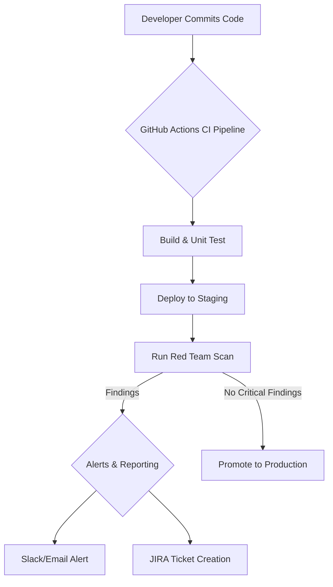

# CI/CD Automation Architecture for Red Team Framework

**Document Version:** 1.0
**Date:** 2025-10-28
**Author:** Jules, Global Red Team

## 1. Overview

This document describes a reference architecture for integrating the Global Red Team Framework into a Continuous Integration/Continuous Deployment (CI/CD) pipeline. The goal is to automate security testing, enabling teams to find and fix vulnerabilities early in the development lifecycle (a "Shift Left" approach).

## 2. Architecture Diagram



## 3. Pipeline Phases

### 3.1. Trigger
The pipeline is triggered on every `push` to the `main` branch or on `pull_request` events.

### 3.2. Build & Deploy to Staging
The standard application build and test process runs. After a successful build, the application is automatically deployed to a dedicated `staging` environment that mirrors production.

### 3.3. Run Red Team Scan
This is the core of the security automation. A dedicated job in the CI pipeline executes the Red Team orchestrator against the newly deployed staging environment.

**Key Steps:**
1.  **Checkout Code:** The CI runner checks out the Red Team Framework code.
2.  **Install Dependencies:** `pip install -r requirements.txt` is run.
3.  **Configure:** The job uses a dedicated `config.staging.json` file, which contains the URL and credentials for the staging environment. Secrets (like `auth_token`) are injected securely using GitHub Actions Secrets.
4.  **Execute Scan:** The orchestrator is run with the desired test suites (e.g., `python3 red_team_orchestrator.py --suites api`).
5.  **Upload Artifacts:** The `red_team_findings.json` and `findings.db` files are uploaded as build artifacts for inspection and trend analysis.

### 3.4. Alerts & Reporting (Gating)
After the scan, the results are processed to determine the next action.
- **Alerting:** A script parses the `red_team_findings.json` output. If any new `CRITICAL` or `HIGH` severity findings are discovered, an alert is sent to a security Slack channel and an email is sent to the development team.
- **Automated Ticketing:** The same script can be used to automatically create JIRA tickets for new findings, assigning them to the appropriate team.
- **Pipeline Gating:** The CI/CD pipeline can be configured to **fail** if the scan introduces any new `CRITICAL` vulnerabilities. This acts as a security gate, preventing regressions from being deployed to production.

---

## 4. Sample GitHub Actions Workflow

Below is a sample workflow file (`.github/workflows/red_team_scan.yml`) that implements this architecture.

```yaml
name: Red Team Security Scan

on:
  push:
    branches: [ main ]
  pull_request:
    branches: [ main ]

jobs:
  security-scan:
    runs-on: ubuntu-latest

    steps:
    - name: Checkout Application Code
      uses: actions/checkout@v3

    # Add steps to build and deploy your application to a staging environment here
    # - name: Build and Deploy to Staging
    #   run: |
    #     # Your deployment script here
    #     echo "STAGING_URL=https://staging.example.com" >> $GITHUB_ENV

    - name: Checkout Red Team Framework
      uses: actions/checkout@v3
      with:
        repository: [Your-GitHub-Org]/global-redteam
        path: global-redteam

    - name: Set up Python
      uses: actions/setup-python@v4
      with:
        python-version: '3.10'

    - name: Install Red Team Dependencies
      run: |
        python -m pip install --upgrade pip
        pip install -r global-redteam/requirements.txt

    - name: Create Staging Config
      run: |
        echo '{
          "api_url": "${{ env.STAGING_URL }}",
          "auth_token": "${{ secrets.STAGING_AUTH_TOKEN }}",
          "swagger_file": "swagger.json",
          "fuzzing": { "enabled": false }
        }' > global-redteam/config.staging.json

    - name: Run Red Team Scan
      run: |
        python global-redteam/red_team_orchestrator.py --suites api --config global-redteam/config.staging.json

    - name: Upload Scan Results
      uses: actions/upload-artifact@v3
      with:
        name: red-team-results
        path: |
          global-redteam/red_team_findings.json
          global-redteam/findings.db

    # Add steps for alerting, ticketing, and gating here
    # - name: Process Results and Gate Pipeline
    #   run: |
    #     # Script to parse JSON and fail the build if critical vulns are found
```

## 5. Terraform Snippet for Infrastructure

To support this pipeline, you might need a dedicated staging environment. Here is a simplified Terraform snippet for creating an AWS EC2 instance to host the staging app.

```terraform
provider "aws" {
  region = "us-west-2"
}

resource "aws_instance" "staging_app" {
  ami           = "ami-0c55b159cbfafe1f0" # Amazon Linux 2 AMI
  instance_type = "t2.micro"

  tags = {
    Name        = "Staging-WebApp"
    Environment = "Staging"
  }

  security_groups = ["staging-sg"]
}

resource "aws_security_group" "staging_sg" {
  name        = "staging-sg"
  description = "Allow HTTP traffic"

  ingress {
    from_port   = 80
    to_port     = 80
    protocol    = "tcp"
    cidr_blocks = ["0.0.0.0/0"] # WARNING: Open to the world. Lock this down in a real environment.
  }
}
```
