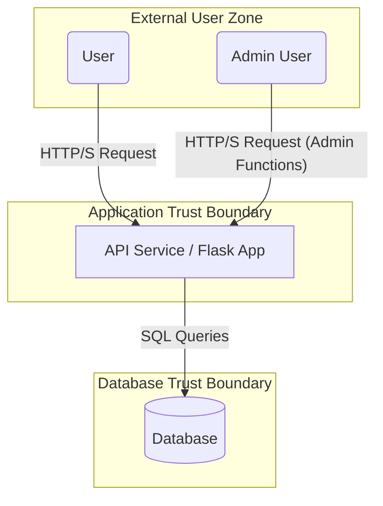

# Threat Model: Vulnerable API Service

**Document Version:** 1.0
**Date:** 2025-10-28
**Target System:** `vulnerable_app` API

## 1. Overview

This document provides a threat model for the Vulnerable API Service. The goal is to identify and analyze potential security threats to the system, its assets, and its data. This model uses the STRIDE methodology.

---

## 2. System Architecture & Data Flow Diagram

The system is a simple web API with three main components:
1.  **User:** A standard, unauthenticated, or authenticated user of the API.
2.  **API Service (Flask App):** The core application that processes requests, enforces business logic, and interacts with the database.
3.  **Database:** A SQLite database that stores user data, including sensitive information.

### Data Flow Diagram (DFD)

### Trust Boundaries
1.  **User to Application:** The boundary between the external user and the API service. All data crossing this boundary is untrusted.
2.  **Application to Database:** The boundary between the API service and the database.

---

## 3. Assets

- **User Data:** Personally Identifiable Information (PII) stored in the database, such as usernames and email addresses.
- **Administrator Privileges:** The ability to perform high-privilege actions, such as viewing all users.
- **Application Availability:** The uptime and performance of the API service.
- **Application Integrity:** The correctness and reliability of the application's code and data.

---

## 4. Threat Analysis (STRIDE)

| Threat Type | Scenario | Potential Impact | Mitigation |
|---|---|---|---|
| **S**poofing | An unauthenticated user successfully impersonates an administrator by forging a JWT or bypassing authentication checks. | Attacker gains full administrative control over the application, allowing them to view, modify, or delete any user's data. | - Implement strong authentication for all sensitive endpoints. - Use cryptographically secure JWTs with proper signature validation. - Enforce strict Role-Based Access Control (RBAC). |
| **T**ampering | An attacker intercepts and modifies an in-transit API request to alter a transaction (e.g., changing the withdrawal amount in a payment request). | Unauthorized financial transactions, data corruption, or privilege escalation. | - Use TLS for all communication to protect data in transit. - Implement server-side validation for all business-critical data. - Use digital signatures or HMACs for critical requests. |
| **R**epudiation | An administrator performs a malicious action (e.g., deleting a user), and there are no logs to prove who performed the action. | Inability to trace malicious activity, leading to failed incident response and lack of accountability. | - Implement comprehensive and immutable audit logging for all sensitive actions. - Log the user ID, timestamp, IP address, and the action performed for every request. |
| **I**nformation Disclosure | An attacker exploits an Insecure Direct Object Reference (IDOR) or injection vulnerability to read sensitive data from the database. | Full or partial breach of sensitive user data, leading to reputational damage and regulatory fines. | - Enforce strict authorization checks to ensure users can only access their own data. - Use parameterized queries (prepared statements) to prevent SQL injection. - Sanitize all outputs to prevent data leakage in error messages. |
| **D**enial of Service | An attacker floods the login API with a high volume of requests, overwhelming the server and making it unavailable for legitimate users. | Service outage, leading to business disruption and loss of customer trust. | - Implement robust rate limiting on all public-facing and authenticated endpoints. - Use a Web Application Firewall (WAF) to block malicious traffic patterns. |
| **E**levation of Privilege | A standard authenticated user discovers a flaw in an administrative endpoint that fails to check their role, allowing them to execute admin-only functions. | A low-privilege user gains full administrative control, a complete compromise of the application's security model. | - Implement and enforce a strict Role-Based Access Control (RBAC) model. - Ensure that every sensitive endpoint verifies the user's role and permissions before executing the request. |
